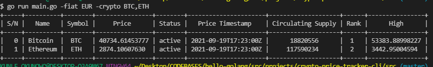

## Crypto-to-Fiat CLI Tracker
A Simple CLI tool for tracking current Fiat prices (i.e. USD,EUR) of various cryptocurrencies (i.e. BTC,ETH) using the [Nomics Official API](https://nomics.com/).

## Getting Started
### Requirements 
- Go installed and setup on Windows,Mac, or Linux (v1.1x)
- A Free API Key from the [Nomics Official Website](https://p.nomics.com/)

### External Dependencies
- `Simpletable`: An efficient library for generating and displaying ASCII tables in the terminal

### STEPS 
#### Clone the repository 
```bash
$ git clone https://github.com/rexsimiloluwah/hello-golang
$ cd hello-golang/src/projects/crypto-price-tracker-cli
```
#### Install required dependencies 
```bash
$ go get -u go get -u github.com/alexeyco/simpletable
```

*Ensure that the dependency is properly installed from your `$GOPATH/src/github.com/alexeyco/simpletable`

#### To run the CLI in your terminal 
- Create a `NOMIC_API_KEY` environment variable
- Run the command: go run main.go -fiat `<fiat-name>` -crypto `<comma-seperated-cryptos>`

i.e.
```bash
$ export NOMIC_API_KEY=<your-nomics-api-key>
$ go run main.go -fiat EUR -crypto BTC,ETH
```

#### Demo


